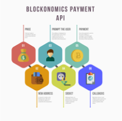

# Basic Info

Using payments API you can easily receive bitcoin payments on your custom website. Payments go directly to your bitcoin wallet. To get registered click on <i>Get started for free</i> on the <a href='https://www.blockonomics.co/merchants#/' target='_blank'>Merchants Page</a>. Feel free to consult below resources:

### <a href='https://insights.blockonomics.co/bitcoin-payments-api-101/?_gl=1*trqa6s*_gcl_au*MTg5MDk3MTgzNS4xNzM3NTE0NTU3*_ga*MjIyMDczNDM0LjE3MzM4MDg5ODQ.*_ga_GQG5T3Z9LZ*MTczNzg3MTY3OC42LjEuMTczNzg3NDIzOC4wLjAuMA..' target='_blank'>Payments API Blog Tutorial</a>

